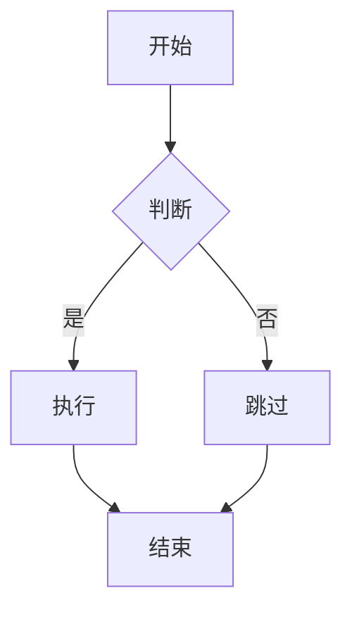
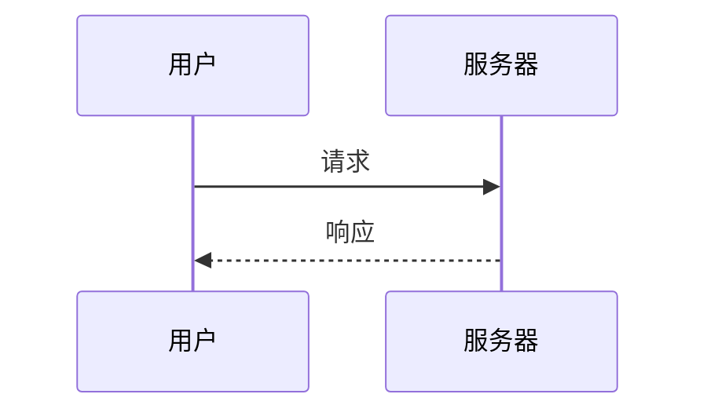
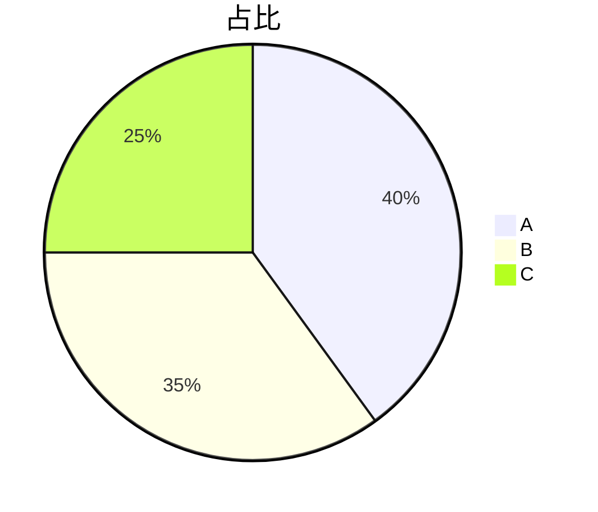

# 标题一：转换器测试

这是一段普通正文，包含 **加粗**、*斜体*、`行内代码` 和 [链接](https://md.doocs.org)。

## 列表与引用

- 无序项 A
  - 嵌套项 A.1
- 无序项 B

1. 有序项一
2. 有序项二

> 这是一段引用文字。

## 代码高亮

```js
function greet(name) {
  console.log(`Hello, ${name}!`)
  return name.length
}
```

## 表格

| 名称 | 值 |
| ---- | -- |
| 速度 | 快 |
| 体积 | 小 |

## KaTeX 数学公式

行内公式 $E = mc^2$，块级公式：

$$
\int_{a}^{b} f(x)\,dx = F(b) - F(a)
$$

## Mermaid 流程图



## Mermaid 时序图



## Mermaid 饼图


